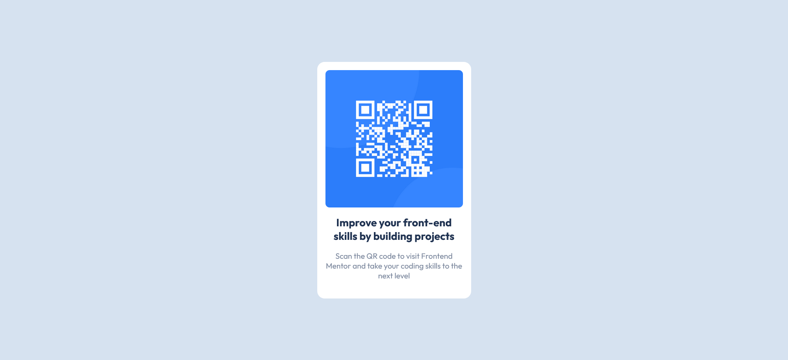

# Frontend Mentor - QR code component solution

This is a solution to the [QR code component challenge on Frontend Mentor](https://www.frontendmentor.io/challenges/qr-code-component-iux_sIO_H). Frontend Mentor challenges help you improve your coding skills by building realistic projects.

## Table of contents

- [Overview](#overview)
  - [Screenshot](#screenshot)
  - [Links](#links)
- [My process](#my-process)
  - [Built with](#built-with)
  - [What I learned](#what-i-learned)
  - [Continued development](#continued-development)
  - [Useful resources](#useful-resources)
- [Author](#author)
- [Acknowledgments](#acknowledgments)

## Overview

### Screenshot



### Links

- Solution URL: [QR code component](https://github.com/abhishek-pb1/fm-qr-code-component)
- Live Site URL: [Live site](https://your-live-site-url.com)

## My process

- Wrote Markup with relevant classes
- Used CSS Reset
- Imported fonts from Google fonts and set it on the body
- Added CSS variables for all the colors used
- Styled the component, adding necessary classes to the markup whenever required

### Built with

- Semantic HTML5 markup
- CSS custom properties
- CSS Grid

### What I learned

This is the CSS Reset and base styling I used

```css
/* Import Font */
@import url("https://fonts.googleapis.com/css2?family=Poppins:wght@300;400;600&display=swap");

/* makes sizing simpler */

*,
*::before,
*::after {
  box-sizing: border-box;
}

/* remove default spacing */
/* force styling of type through styling, rather than elements */

* {
  margin: 0;
  padding: 0;
}

/* dark mode user-agent-styles */

html {
  color-scheme: dark light;
}

/* min body height */

body {
  min-height: 100vh;
}

/* responsive images/videos */
img,
picture,
svg,
video {
  display: block;
  max-width: 100%;
}
/* -------------------- */
/* OPTIONAL STYLING */
/* -------------------- */

/* centered contaier  */
.container {
  max-width: 960px;
  margin: auto;
}

/* Setting Color variables */
:root {
  --primary-color: #f99fbd;
  --dark-color: #333;
  --light-color: #fff;
}

body {
  background-color: var(--primary-color);
  color: var(--light-color);
  font-family: "Poppins", sans-serif;
  font-size: 1rem;
  line-height: 2;
}

a {
  text-decoration: none;
  color: #ffcc00;
}

a:hover {
  text-decoration: underline;
}
```

### Continued development

CSS reset was useful in keeping the images managible. Also, I want to master grid better.

### Useful resources

- [Kevin Powell's CSS Reset video](https://www.youtube.com/watch?v=2lyDv0wOQuQ) - This helped me with the CSS Reset I'm using. I really liked this and will use it going forward.

## Author

- Website - [Abhishek](abhishekpb.is-a.dev)
- Frontend Mentor - [@abhishek-pb1](https://www.frontendmentor.io/profile/abhishek-pb1)
- Twitter - [@heyiam_abhi](https://twitter.com/heyiam_abhi)

## Acknowledgments

If you haven't already, check out Kevin Powell's YouTube channel. Lot of good stuff in there.
